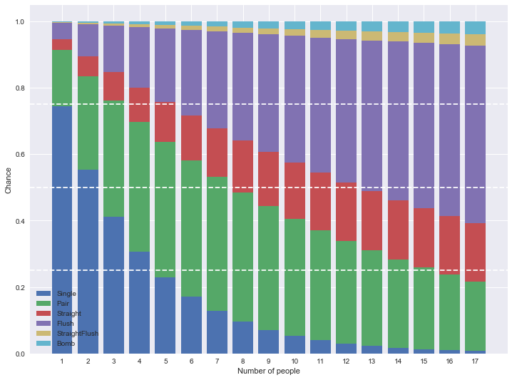

# GoldenFlower
 炸金花概率分析
 ---
《炸金花》是流传的一种民间纸牌游戏。使用一副去掉到大小王的扑克牌，共 52 张牌，游戏时每人三张牌，牌面从大到小依次为：  
>
+ 豹子（炸弹）：三张点相同的牌。例：AAA、222。
+ 同花顺（顺金、色托）：花色相同的顺子。例：黑桃456、红桃789。
+ 同花（金花、色皮）：花色相同，非顺子。例：黑桃368，方块145。
+ 顺子（拖拉机）：花色不同的顺子。例：黑桃5红桃6方块7。最大的顺子为花色不同的QKA，最小的顺子为花色不同的123。
+ 对子：两张点数相同的牌。例：223，334。
+ 单张：三张牌不组成任何类型的牌。

游戏中手中的牌是否全场最大对玩家策略影响很大，然而这个概率会随游戏人数而变化，本项目使用穷举、近似计算、蒙特卡洛等方法对这一概率进行计算。详情见[GoldenFlower.ipynb](./GoldenFlower.ipynb)

---
炸金花多人游戏各牌型全场最大概率图  

